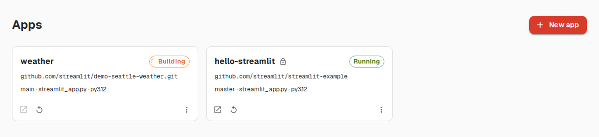

# Orbital

Self-hosted platform for deploying, running, and managing [Streamlit](https://streamlit.io)
apps — and plain static sites — on Kubernetes. Point it at a git repository
and the app is live on its own subdomain minutes later, with secrets
management, logs, automatic redeploys on push, and hibernation of idle apps.

**[orbital project site →](https://gggard.github.io/orbital/)**

  

## Capabilities

- **Deploy from git** — give a repo URL, branch and main file; the platform
  clones, resolves dependencies (`uv.lock` / `requirements.txt` /
  `pyproject.toml`), builds an immutable container image, and deploys it
  behind `https://<slug>.<apps-domain>`. Build/deploy status and logs stream
  live to the dashboard.
- **Static sites too** — deploy a plain static site (or an npm-built SPA)
  the same way, as a second app type alongside Streamlit. No build step
  needed by default; set a build command (e.g. `npm run build`) and output
  directory for anything that needs one.
- **Automatic redeploys** — a per-app webhook (GitHub, GitLab, Gitea, or
  generic) triggers a rebuild on push; unchanged dependencies reuse the
  cached layer for fast rebuilds.
- **Secrets management** — TOML secrets edited in the dashboard, mounted at
  `.streamlit/secrets.toml` so `st.secrets` works exactly as it does locally.
  Updates restart the app without a rebuild.
- **Sharing & access control** — apps are public or private. Private apps sit
  behind OIDC login (any provider with a groups claim) with per-app viewer
  allowlists; the console itself has group-based admin/creator/viewer roles
  and per-app ownership.
- **App management** — live log streaming, reboot (clears cached state
  without rebuilding), rollback to a previous build, per-app CPU/memory
  indicators, and delete.
- **Hibernation** — idle apps scale to zero and wake automatically on the
  next request.
- **Analytics** — per-app view counts and unique-viewer trends for owners and
  admins.
- **Safe multi-tenancy** — every app is an isolated, hardened Deployment
  (non-root, read-only rootfs, no service-account token); builds run in a
  separate namespace via rootless BuildKit.

  

See [SPEC.md](SPEC.md) for the full functional specification and architecture.

## Documentation

| Guide | Audience |
|---|---|
| [docs/INSTALL.md](docs/INSTALL.md) | Install the Helm chart on a real cluster |
| [docs/ADMIN.md](docs/ADMIN.md) | Operate the platform (roles, RBAC, upgrades) |
| [docs/USER.md](docs/USER.md) | Deploy and manage your own apps |
| [docs/API.md](docs/API.md) | Deploy and monitor apps via the REST API |
| [docs/DEVELOPMENT.md](docs/DEVELOPMENT.md) | Contribute to Orbital (local dev on minikube) |
| [CONTRIBUTING.md](CONTRIBUTING.md) | PR/issue workflow and contribution guidelines |
| [SPEC.md](SPEC.md) | Full specification |

## Status

**Current milestone**: core deploy pipeline — create an app from a git URL via
API/dashboard, in-cluster BuildKit image build (Python packages only, no apt
packages), deploy behind ingress, logs, redeploy webhook, secrets, reboot,
delete, OIDC auth, hibernation, analytics (see SPEC §4.6–4.8).

## Contributing

Contributions are welcome — see [CONTRIBUTING.md](CONTRIBUTING.md) for the
workflow and [docs/DEVELOPMENT.md](docs/DEVELOPMENT.md) for local setup.

## License

[GPL-3.0](LICENSE)
