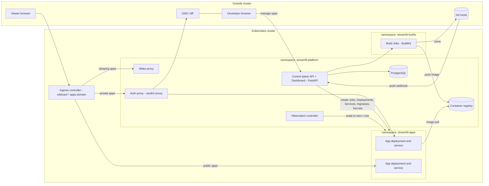
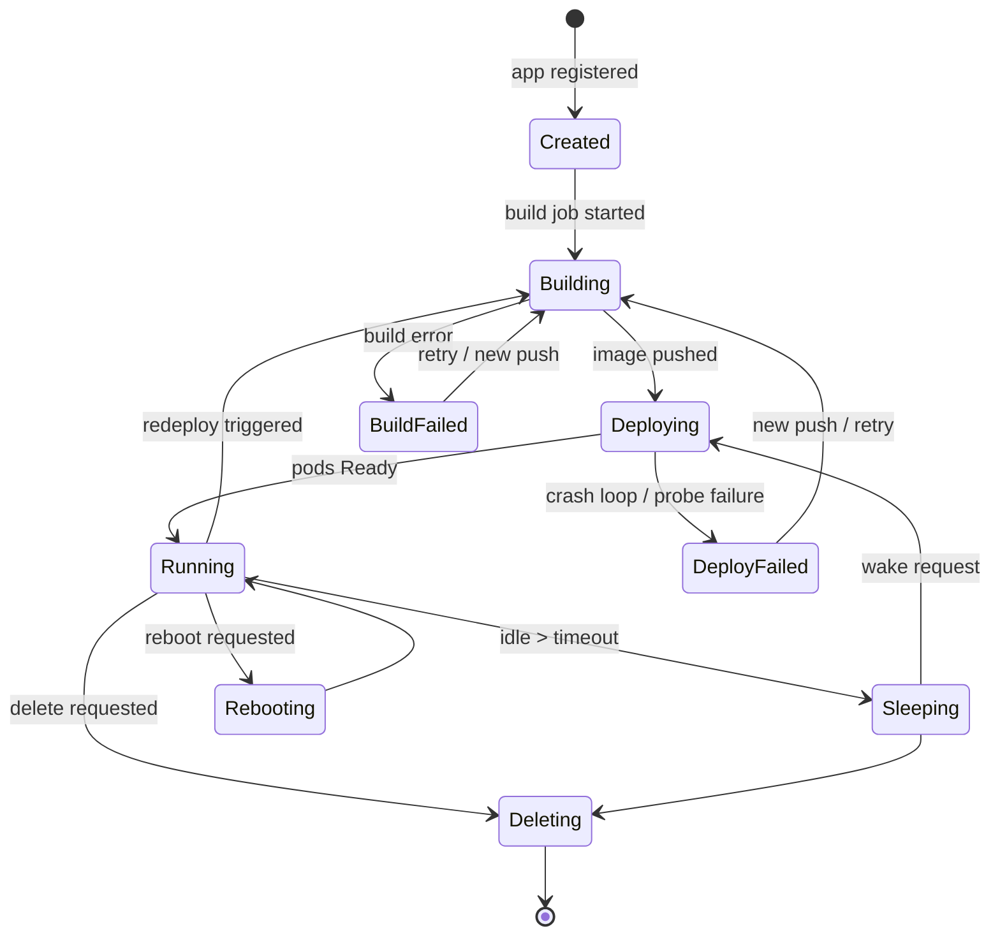

# Specification: Self-Hosted Streamlit Hosting Platform on Kubernetes

**Status:** Draft v1
**Date:** 2026-07-18

---

## 1. Overview & Goals

This document specifies a self-hosted platform for deploying, running, and managing [Streamlit](https://streamlit.io) applications on a Kubernetes cluster. The platform is modeled on the user experience of [Streamlit Community Cloud](https://docs.streamlit.io/deploy/streamlit-community-cloud): a developer points the platform at a git repository, and minutes later the app is live on its own subdomain, with secrets management, logs, automatic redeploys on push, and hibernation of idle apps.

### Goals

- **Community-Cloud-like developer experience**: deploy from a git repo in a few clicks, manage apps from a web dashboard.
- **Self-contained**: runs entirely on the operator's Kubernetes cluster; no dependency on external SaaS beyond the git hosts users deploy from and the organization's OIDC identity provider.
- **Safe multi-tenancy**: apps are untrusted code; they are isolated from each other and from the platform.
- **Reproducible builds**: each app version is an immutable container image.

### Non-Goals (v1)

- **No custom Linux (apt) packages.** Community Cloud supports a `packages.txt` for apt packages; this platform does **not**. Only Python packages installable with pip/uv into the shared base image are supported. Apps needing system libraries beyond those in the base image are out of scope.
- No in-browser code editing (Community Cloud's "Edit with Codespaces" equivalent).
- No conda/`environment.yml` or Pipfile support (see §4.3).
- No multi-cluster or multi-region deployment.
- No public app gallery / user profile pages.

---

## 2. Personas & Roles

| Role | Description | Capabilities |
|---|---|---|
| **Admin** | Platform operator | Everything Developers can do, for all apps; configure platform defaults (resource limits, base images, Python versions, hibernation timeout, domain); manage users. |
| **Developer** | Deploys and manages apps | Create/delete apps they own; view logs; edit secrets; reboot; configure sharing; view analytics. |
| **Viewer** | Uses deployed apps | Open public apps; open private apps they are allowlisted for (after OIDC login). |

Developers and Admins authenticate to the dashboard via the organization's OIDC identity provider. Roles are derived from IdP group claims (configurable mapping) or assigned by an Admin.

---

## 3. User Journeys

### 3.1 Deploy a new app

1. Developer signs in to the dashboard and clicks **New app**.
2. Fills in the deploy form:
   - **Git repository URL** (https or ssh; any host — GitHub, GitLab, Gitea, Bitbucket, internal).
   - **Credentials** for private repos: a per-app or workspace-level access token / deploy key.
   - **Branch** (default: repository default branch).
   - **Main file path** (entrypoint, e.g. `src/app.py`; default `streamlit_app.py`).
   - **Subdomain slug** (default: derived from repo name; must be unique; DNS-safe).
   - **Advanced settings** (optional): Python version (from the platform's supported list, default latest), initial secrets (TOML).
3. Platform clones the repo, resolves dependencies (§4.3), builds an image (§6.3), and deploys it (§6.4). The dashboard shows live build/deploy status and streams build logs.
4. The app is reachable at `https://<slug>.<apps-domain>` and the developer is shown a webhook URL + secret to configure push-triggered redeploys on their git host.

### 3.2 View a private app

1. Viewer opens `https://<slug>.<apps-domain>`.
2. The auth proxy finds no valid session and redirects to the OIDC IdP.
3. After login, the platform checks the viewer's email/groups against the app's viewer allowlist. Allowed → proxied to the app (websocket included). Denied → 403 page ("You don't have access — ask the app owner to invite you").
4. If the app is hibernated, the viewer sees a "Waking up…" interstitial while it scales from zero (§4.8).

---

## 4. Functional Requirements

Each requirement notes its Streamlit Community Cloud (SCC) analog.

### 4.1 App deployment (SCC: "Deploy your app")

- **FR-1.1** An app is defined by: git URL, git credentials (optional), branch, main file path, Python version, subdomain slug, secrets, sharing settings, resource tier.
- **FR-1.2** The main file path is interpreted relative to the repository root. The app's working directory at runtime is the repository root (matching SCC's path semantics).
- **FR-1.3** Deploys are asynchronous; the dashboard shows the state machine (§7.2) and streams build logs.
- **FR-1.4** Redeploying the same app replaces the running version with zero-config rollover (new pods must be Ready before old pods terminate).
- **FR-1.5** The platform retains the last N (default 5) built images per app to support one-click rollback.

### 4.2 Automatic redeploys (SCC: "your app updates on git push")

- **FR-2.1** Each app has a unique webhook endpoint (`POST /webhooks/apps/{id}/{token}`) accepting generic, GitHub, GitLab, and Gitea push payloads. A push to the tracked branch triggers a redeploy.
- **FR-2.2** As a fallback for git hosts that cannot deliver webhooks into the cluster, per-app polling can be enabled (configurable interval, default 5 min) comparing the remote branch head to the deployed commit.
- **FR-2.3** If the changed commit does not touch the dependency file (§4.3) or the Python version, the build reuses the cached dependency layer — only the code layer is rebuilt (fast path). Dependency changes trigger a full dependency install (SCC behaves the same).
- **FR-2.4** Redeploy triggers are rate-limited per app (default: max 5 per minute, mirroring SCC's update rate limit); excess triggers are coalesced into one trailing redeploy.

### 4.3 Dependency resolution (SCC: "App dependencies")

- **FR-3.1** The platform searches for exactly one Python dependency file, first in the main file's directory, then in the repository root — the same search order as SCC. Detection priority:
  1. `uv.lock` (with `pyproject.toml`)
  2. `requirements.txt`
  3. `pyproject.toml` (PEP 621 / poetry — installed via `uv pip install .` or exported deps)
  Only the first file found is used; others are ignored (a build-log warning lists ignored files).
- **FR-3.2** `Pipfile` and `environment.yml` (conda) are **not supported** in v1. If found and no supported file exists, the build fails with a clear message. If found alongside a supported file, a warning is logged.
- **FR-3.3** `packages.txt` (SCC's apt-package mechanism) is **detected and rejected with a warning**: the build proceeds, the log states that Linux packages are not supported on this platform.
- **FR-3.4** Installation uses `uv` (with pip-compatible resolution) into a virtualenv layered on the base image.
- **FR-3.5** Streamlit is preinstalled in the base image at a platform-pinned version; an app's dependency file may override it with its own pinned `streamlit==x.y.z`.
- **FR-3.6** Supported Python versions: the set of CPython minor versions currently receiving security updates (admin-configurable list; one base image per version). Default: latest supported.

### 4.4 Secrets management (SCC: "Secrets management")

- **FR-4.1** Each app has a secrets blob in TOML format, edited in the dashboard (create/view/update), validated as TOML on save.
- **FR-4.2** Secrets are stored as a Kubernetes `Secret` and mounted into the app container at `<repo-root>/.streamlit/secrets.toml`, so `st.secrets` works exactly as it does locally and on SCC.
- **FR-4.3** Secret updates do **not** require a rebuild. Saving secrets triggers a rolling restart of the app pods (propagation within ~1 minute).
- **FR-4.4** A `secrets.toml` committed to the repository is ignored (the mounted secret shadows it) and a build warning is emitted.
- **FR-4.5** Secrets are write/replace-visible only to the app's owner(s) and Admins; audit-logged on change.

### 4.5 App management (SCC: "Manage your app")

- **FR-5.1 Logs**: live-streaming runtime logs (stdout/stderr of the app container) in the dashboard; downloadable as a file; build logs retained per build.
- **FR-5.2 Reboot**: restarts the app's pods (clears memory and `st.cache_*` state) without rebuilding.
- **FR-5.3 Delete**: removes the app and all its Kubernetes resources, images (per retention policy), secrets, and analytics.
- **FR-5.4 Favorites**: developers can pin apps to the top of their workspace list.
- **FR-5.5 Settings**: change branch, main file, Python version (triggers rebuild), subdomain slug (triggers ingress update), sharing, secrets, resource tier.
- **FR-5.6 Resource indicators**: the dashboard shows per-app memory/CPU usage vs. limits and flags apps that were OOM-killed or restarted (SCC's "over its resource limits" indicator).

### 4.6 Sharing & viewer access (SCC: "Share your app")

- **FR-6.1** Each app is **public** (anyone with the URL) or **private** (OIDC login + allowlist). Default: private.
- **FR-6.2** Private-app allowlists contain email addresses and/or IdP group names. Matching is against the OIDC ID-token `email` (verified) and group claims.
- **FR-6.3** Owners manage the allowlist from the dashboard ("invite viewers"). Optionally, the platform sends an email notification with the app link (requires SMTP configuration; feature is disabled if SMTP is not configured).
- **FR-6.4** Public apps can be embedded in other sites (`?embed=true` supported as in upstream Streamlit); the platform does not block framing for public apps, and blocks it for private apps.
- **FR-6.5** No limit on the number of private apps (unlike SCC's one-private-app rule).

### 4.7 Analytics (SCC: "App analytics")

- **FR-7.1** Per app: total view count, unique viewers per day/week/month, last-visited timestamp.
- **FR-7.2** For private apps, the viewer list shows authenticated identities; public app viewers are counted anonymously (no cookies beyond the auth session; counting is based on ingress/proxy logs).
- **FR-7.3** Analytics are visible to the app's owner(s) and Admins.

### 4.8 Hibernation (SCC: apps sleep after 12 h of inactivity)

- **FR-8.1** An app receiving no HTTP/websocket traffic for the hibernation timeout (default **12 h**, configurable per platform and per app; can be disabled per app) is scaled to zero replicas. State: `Sleeping`.
- **FR-8.2** Any incoming request wakes the app: the wake proxy returns an interstitial "This app is waking up" page (auto-refreshing), scales the Deployment to 1, and routes traffic once the pod is Ready. Target cold-start: < 30 s (image already on a node) / < 2 min (image pull needed).
- **FR-8.3** Waking does not require authentication beyond what the app's sharing mode requires (matching SCC: "anyone can wake them").

### 4.9 Locked runtime configuration (SCC: "Community Cloud locks certain configuration options")

- **FR-9.1** The platform mounts a `config.toml` that overrides app-supplied config for:
  - `client.showErrorDetails = false` (no tracebacks to viewers)
  - `server.enableXsrfProtection = true`
  - `server.enableCORS = true`
  - `server.headless = true`, `server.port`, `server.address` (platform-controlled)
  - `browser.gatherUsageStats = false` (unlike SCC — self-hosted default is telemetry off)
- **FR-9.2** All other options from the repo's `.streamlit/config.toml` (repo root only, matching SCC) are honored — theming in particular.

---

## 5. Architecture

### 5.1 Control plane (FastAPI, Python)

The single stateful brain of the platform.

- **REST API** (§8) consumed by the dashboard and by automation.
- **App registry** in PostgreSQL: apps, owners, builds, deploy history, allowlists, analytics aggregates, audit log.
- **Reconciler**: a background loop (Kubernetes Python client, `kubernetes` package) that drives each app from desired state (DB) to actual state (cluster objects), and watches pod/job status to update app state. The reconciler owns all Kubernetes writes; the API only mutates the DB.
- **Webhook receiver** and **git poller** (§4.2).
- **Log streamer**: server-sent events / websocket endpoint proxying `read_namespaced_pod_log(follow=True)` and build-job logs.
- **Dashboard**: server-rendered or SPA web UI served by the same FastAPI service. Screens: workspace (app list + favorites + states), deploy wizard, app detail (logs, analytics, settings, secrets editor, sharing, danger zone).

### 5.2 Build system

- **Base images**: one platform-maintained image per supported Python version: Debian-slim + CPython + `uv` + pinned Streamlit + a small curated set of common system libraries (e.g. `libgomp`, CA certs). Admins rebuild/update base images on their own cadence; the tag is pinned per app build for reproducibility.
- **Builder**: a Kubernetes `Job` per build in the `streamlit-builds` namespace running **BuildKit** (rootless) — chosen over Kaniko because BuildKit is actively maintained and has robust cache-mount support for pip/uv caches. The job:
  1. Clones the repo at the target commit (token/deploy-key from a build-scoped secret).
  2. Detects the dependency file (§4.3) and generates a Dockerfile from a platform template:
     `FROM base:pyX.Y` → copy dependency file → `uv pip install` (cache mount) → copy app code → set entrypoint `streamlit run <main file>`.
  3. Pushes the image to the internal registry, tagged `apps/<app-id>:<commit-sha>`.
- **Registry**: an in-cluster registry (e.g. `registry:2` or Harbor) or any registry the operator configures. Retention: keep the last N images per app (FR-1.5); a garbage-collection job prunes the rest.
- **Isolation**: build jobs run as non-root, with no cluster credentials beyond registry push and the app's read-only git credential; NetworkPolicy allows egress only to git hosts and the registry.

### 5.3 App runtime

Per app, in the shared `streamlit-apps` namespace (one namespace for all apps — simpler quota and NetworkPolicy management than namespace-per-app; per-pod isolation is enforced instead, see §9):

| Object | Purpose |
|---|---|
| `Deployment` (1 replica) | Runs the app image; `streamlit run <main file>` |
| `Service` | ClusterIP for the pods |
| `Ingress` | `<slug>.<apps-domain>` → Service (or auth proxy for private apps) |
| `Secret` | The app's `secrets.toml` + git credential |
| `ConfigMap` | Locked `config.toml` (§4.9) |
| `NetworkPolicy` | Default-deny between app pods (§9) |

- **Resources**: default tier `requests: 500m CPU / 1 GiB`, `limits: 1 CPU / 2 GiB` (SCC guarantees ~1 GB). Admins define tiers; developers pick from allowed tiers.
- **Replicas**: 1 by default (Streamlit sessions are sticky to a process; horizontal scaling requires session affinity and is a future-work item — v1 supports 1 replica per app, matching SCC).
- **Health**: readiness/liveness probes on Streamlit's `/_stcore/health` endpoint.
- **Ephemeral storage**: apps get a writable ephemeral volume (`emptyDir`, size-limited, default 1 GiB); contents do not survive restarts or hibernation — identical to SCC's ephemeral-container semantics.

### 5.4 Ingress, routing, TLS

- Wildcard DNS `*.<apps-domain>` (e.g. `*.apps.example.com`) points at the ingress controller (NGINX Ingress or equivalent with websocket support — Streamlit requires long-lived websockets; proxy read timeouts set ≥ 1 h).
- TLS via cert-manager with a wildcard certificate (DNS-01) — one cert covers all app subdomains; no per-app issuance latency.
- The dashboard lives at a dedicated host, e.g. `streamlit.<domain>`.

### 5.5 Authentication layer

- **Dashboard**: OIDC login (authorization-code flow) handled by the control plane; sessions in signed cookies.
- **Private apps**: an `oauth2-proxy` deployment (shared, multi-host) fronts private-app ingresses via auth-request annotations. After OIDC login, oauth2-proxy calls the control plane's authorization endpoint (`GET /authz?host=<slug>&email=…&groups=…`) which evaluates the app's allowlist. Decisions are cached briefly (60 s) so allowlist edits propagate quickly.
- **Public apps**: ingress routes directly to the app service; no auth.

### 5.6 Hibernation controller & wake proxy

- The **hibernation controller** (part of the control plane or a sidecar process) reads per-app last-activity timestamps. Activity is measured at the ingress/auth-proxy layer (access-log shipping or a lightweight traffic-mirroring counter) and covers websocket traffic. Apps idle past their timeout are scaled to 0 and their ingress is repointed at the wake proxy; state → `Sleeping`.
- The **wake proxy** serves the interstitial page, asks the control plane to scale the app to 1, polls readiness, then the control plane repoints the ingress back at the app service. Requests arriving during wake-up get the interstitial (auto-refresh every 2 s).

---

## 6. App State Machine

Naming/labeling conventions: all per-app objects are named `app-<app-id>` and labeled `app.streamlit-hosting.io/id=<app-id>`, `app.streamlit-hosting.io/managed-by=control-plane`. The reconciler only touches objects carrying the managed-by label.

---

## 7. API Surface (v1)

All endpoints under `/api/v1`, authenticated by dashboard session or personal API token. OpenAPI schema published by FastAPI.

| Method & path | Purpose |
|---|---|
| `POST /apps` | Create app (git URL, branch, main file, slug, python version, …) |
| `GET /apps` / `GET /apps/{id}` | List / get apps (with state, URL, last deploy) |
| `PATCH /apps/{id}` | Update settings (branch, main file, slug, tier, sharing…) |
| `DELETE /apps/{id}` | Delete app and all resources |
| `POST /apps/{id}/deploy` | Trigger redeploy (optional `commit`) |
| `POST /apps/{id}/reboot` | Restart pods without rebuild |
| `POST /apps/{id}/rollback` | Redeploy a previous retained image |
| `GET /apps/{id}/logs?follow=true` | Stream runtime logs (SSE) |
| `GET /apps/{id}/metrics` | CPU/memory usage series vs. limits (FR-5.6; needs metrics-server) |
| `GET /apps/{id}/builds` / `GET /builds/{id}/logs` | Build history / build logs |
| `GET /apps/{id}/secrets` / `PUT /apps/{id}/secrets` | Read / replace secrets TOML |
| `GET /apps/{id}/viewers` / `PUT /apps/{id}/viewers` | Manage private-app allowlist |
| `GET /apps/{id}/analytics` | View counts, unique viewers, last visited |
| `POST /webhooks/apps/{id}/{token}` | Git push webhook (unauthenticated; token in path + optional HMAC) |
| `GET /authz` | Internal: allowlist decision for auth proxy |
| `GET /platform/config` | Supported Python versions, tiers, domains (admin: PATCH) |

---

## 8. Security Considerations

App code is **untrusted**. Controls, in the app runtime:

- **Pod hardening**: `runAsNonRoot`, no privilege escalation, all capabilities dropped, seccomp `RuntimeDefault`, read-only root filesystem (writable `emptyDir` mounts for `/tmp`, repo dir, uv cache).
- **No cluster access**: `automountServiceAccountToken: false`; a dedicated no-permission ServiceAccount.
- **NetworkPolicy**: app pods — default deny; egress allowed to the internet (apps legitimately call external APIs) but **denied** to cluster-internal CIDRs (control plane, DB, registry, kubelet, cloud metadata endpoints e.g. `169.254.169.254`); ingress only from the ingress controller / auth proxy.
- **Quotas**: per-pod CPU/memory limits (tier), `emptyDir` size limits, `ResourceQuota` + `LimitRange` on the apps namespace, PID limits.
- **Optional stronger sandboxing**: the spec recommends noting gVisor (`RuntimeClass: gvisor`) or Kata Containers as an admin opt-in for hostile-tenant scenarios; not required for v1 trusted-organization use.
- **Secrets**: app secrets are only mounted into that app's pods; API access restricted to owners/admins; audit log on read-of-value and write. Git credentials for private repos are stored as Kubernetes Secrets, mounted only into build jobs.
- **Build isolation**: rootless BuildKit, no shared daemon, per-build ephemeral workspace, egress restricted (§5.2).
- **Platform**: XSRF on for apps (locked config), CSRF protection on the dashboard, webhook endpoints validated by per-app token and optional provider HMAC signature.

---

## 9. Constraints & Limitations (platform "Status" page)

- Only pip/uv-installable **Python** packages; no apt/system packages (`packages.txt` ignored with a warning).
- Exactly one dependency file per app; detection order as in §4.3. `Pipfile`/conda unsupported.
- Supported Python versions: security-supported CPython only, as configured by the Admin.
- One replica per app; no horizontal scaling of a single app in v1.
- Ephemeral storage only; files written by the app do not survive restarts or hibernation.
- Locked config values (§4.9) override the repo's `config.toml`.
- Redeploy triggers rate-limited to 5/min per app.
- Only one `.streamlit/config.toml` (repo root) is honored, matching SCC.

---

## 10. Out of Scope / Future Work

- Conda (`environment.yml`) and `Pipfile` support.
- Horizontal scaling of a single app (requires websocket session affinity).
- In-browser editing / dev containers.
- Deep GitHub App integration (repo picker, status checks on PRs, preview deploys per PR).
- Persistent per-app volumes.
- App gallery and public developer profiles.
- Multi-cluster / multi-region.

---

## Appendix A: Mapping to Streamlit Community Cloud features

| SCC feature | This platform |
|---|---|
| Deploy from GitHub repo | Deploy from any git URL (§4.1) |
| Dependency file auto-detection | Same order, minus Pipfile/conda (§4.3) |
| `packages.txt` apt packages | **Not supported** — warning (§4.3) |
| Python version picker | Supported (§4.3) |
| Secrets TOML → `st.secrets` | Supported, K8s Secret mount (§4.4) |
| Update on git push | Webhook + polling (§4.2) |
| Logs / reboot / delete / favorites | Supported (§4.5) |
| Analytics & viewer list | Supported (§4.7) |
| Sleep after 12 h, anyone wakes | Scale-to-zero + wake proxy (§4.8) |
| Public apps + private with invited viewers | Public + OIDC allowlist (§4.6) |
| One private app limit | No limit (§4.6) |
| ~1 GB RAM per app | Configurable tiers, default 1–2 GiB (§5.3) |
| Locked config options | Supported (§4.9) |
| Custom subdomain | Supported (§4.1, §5.4) |
| Edit with Codespaces | Out of scope (§10) |
