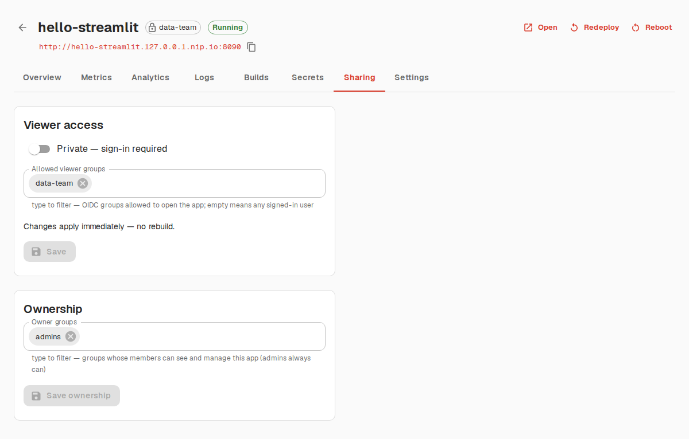

# Orbital — Developer Guide

Audience: contributors working on Orbital itself. For deploying the
platform on a real cluster, see [INSTALL.md](INSTALL.md); for platform
operations, [ADMIN.md](ADMIN.md); for the end-user flow, [USER.md](USER.md);
for the full spec, [../SPEC.md](../SPEC.md).

This guide covers local development on minikube.

**Current milestone**: core deploy pipeline — create an app from a git URL via
API/dashboard, in-cluster BuildKit image build (Python packages only, no apt
packages), deploy behind ingress at `<slug>.<apps-domain>`, logs, redeploy
webhook, secrets, reboot, delete, OIDC auth, hibernation, analytics (see
SPEC §4.6–4.8).

## Local development (minikube)

```bash
make install          # python venv + dependencies
make setup-minikube   # minikube profile 'orbital' + registry + ingress + base image; writes .env
make run              # control plane + dashboard on http://localhost:8000
```

Then start the management console (Next.js + MUI, see
[UI-SPEC.md](UI-SPEC.md)):

```bash
make ui-install
make ui        # console on http://localhost:3000 (make ui-dev for hot reload)
```

Open http://localhost:3000 and deploy an app, e.g.
repo `https://github.com/streamlit/streamlit-example`, branch `master`,
main file `streamlit_app.py`. (A minimal fallback dashboard also exists at
http://localhost:8000.) Node.js ≥ 20 is required for the console; on this dev
host it is installed at `~/.local/node/bin`.

### Working over VS Code Remote-SSH

Everything (control plane, console, minikube ingress) binds/runs on the
*remote* host. VS Code's **Ports** panel forwards remote ports to
`localhost` on your local machine, tunneled over the same SSH connection —
no separate SSH `-L` flags needed. Forward these three:

| Remote port | What it is | Local URL |
|---|---|---|
| `3000` | console (Next.js) — proxies all API calls to the control plane itself | `http://localhost:3000` |
| `8000` | control plane's own dashboard/API | `http://localhost:8000` |
| `8090` | minikube ingress (apps) — see below | `http://<slug>.127.0.0.1.nip.io:8090` |

Port 8090 needs two extra steps first, because app URLs are normally
host-routed through the minikube ingress using the minikube node's own IP
(`<slug>.<minikube-ip>.nip.io`), which isn't reachable from your local
machine — only from the remote host itself:

1. In `.env` set the domain to loopback nip.io and pick a tunnel port, then
   restart the control plane (running apps' ingresses converge automatically):

   ```
   ORBITAL_APPS_DOMAIN=127.0.0.1.nip.io
   ORBITAL_APPS_URL_PORT=8090
   ```

2. On the remote, expose the ingress controller on localhost:

   ```bash
   kubectl --context orbital -n ingress-nginx \
     port-forward svc/ingress-nginx-controller 8090:80
   ```

Then forward `8090` in VS Code's Ports panel too (keep the local port number
identical to the remote one for all three). Now `http://localhost:8000` opens
the dashboard, `http://localhost:3000` opens the console, and every app link
(`http://<slug>.127.0.0.1.nip.io:8090`) resolves to your machine's loopback,
goes through the VS Code tunnel, and is routed by hostname on the ingress —
websockets included. `ORBITAL_APPS_URL_PORT`/`ORBITAL_CONTROL_PLANE_SERVICE_HOST`
are independent settings — changing the apps domain/port for remote-SSH
browsing doesn't affect the gateway IP the cluster uses to reach the host (see
below).

### Troubleshooting: nested Docker / LXC dev hosts

Running minikube's docker driver inside an already-containerized dev host
(LXC, an unprivileged sandbox, etc.) hits two issues that don't show up on a
bare VM or a normal workstation. `make setup-minikube` (as of this doc)
handles both automatically — this section is for understanding *why*, or for
fixing a `.env`/cluster that predates the fix.

- **`minikube start` fails, control-plane pods crash-loop.** Symptom:
  `kubeadm init` times out waiting for `kube-apiserver`/`scheduler`/
  `controller-manager` to become healthy, and `docker run`/`docker logs`
  inside the minikube node shows `error setting rlimit type 7: operation not
  permitted` for *every* container, not just Kubernetes ones. Cause: the
  outer host has a lower open-files ceiling (`ulimit -Hn`) than minikube's
  inner dockerd's default (`--default-ulimit=nofile=1048576:1048576`) — and a
  process can't raise its own hard rlimit past what the host enforces, even
  as root. Fix: start minikube with
  `--docker-opt='default-ulimit=nofile=<host ulimit -Hn>:<same>'` so the
  inner daemon's default matches what the host actually allows.

- **Deployed apps return HTTP 500 through their ingress URL — any app, not
  just hibernated ones.** The reconciler always points the ingress's
  activity-tracking `auth-url` at the in-cluster
  `orbital-control-plane.orbital-platform.svc.cluster.local` Service, which
  only exists in the production Helm-chart topology. In local dev the
  control plane runs on the *host* (`make run`), so that DNS name resolves to
  nothing inside the cluster and nginx's `auth_request` 502s, turning every
  app view into a 500. Fix: set `ORBITAL_CONTROL_PLANE_SERVICE_HOST` in
  `.env` to the minikube docker-bridge gateway IP (one below the minikube
  node IP, e.g. node `192.168.49.2` → gateway `192.168.49.1`) and restart the
  control plane — the same technique `deploy/auth/setup-auth.sh` already uses
  for the OIDC callback URL. `make setup-minikube` writes this for you now;
  if apps 500 on an older `.env`, add the line and restart.

## Authentication (public vs. private apps)

Apps are **public** (anyone with the URL) or **private** — restricted to OIDC
groups. Deploy the demo auth stack (Keycloak + oauth2-proxy) with:

```bash
bash deploy/auth/setup-auth.sh   # then restart the control plane
```

Demo users: `alice/alice123` (group `data-team`), `bob/bob123` (group
`viewers`). Keycloak admin console: `http://keycloak.<domain>:<port>`
(admin/admin).

Make an app private via the dashboard (Private checkbox + groups field) or:

```bash
curl -X PATCH localhost:8000/api/v1/apps/<id> -H 'Content-Type: application/json' \
  -d '{"public": false, "allowed_groups": ["data-team"]}'
```

Access-control changes apply live (no rebuild): the reconciler swaps the
ingress auth annotations. Flow: nginx `auth_request` → control-plane
`/authz/{app_id}` → session check against oauth2-proxy `/oauth2/auth` → group
intersection with `allowed_groups` (empty list = any signed-in user).
Unauthenticated users are redirected to Keycloak; authenticated users outside
the allowed groups get 403.

<p align="center">
  
</p>

## Console RBAC (group-based)

The management console itself is behind OIDC login. Roles come from group
claims via `.env` mappings — users in none of the mapped groups cannot sign in:

| Setting | Role | Rights |
|---|---|---|
| `ORBITAL_ADMIN_GROUPS` | admin | sees and manages every app |
| `ORBITAL_CREATOR_GROUPS` | creator | creates apps; manages apps whose `owner_groups` intersect their groups |
| `ORBITAL_VIEWER_GROUPS` | viewer | read-only (overview/logs/builds) on apps whose `owner_groups` intersect their groups |

Every app has `owner_groups` (defaults to its creator's groups): only members
of those groups — plus admins — can see the app at all (others get 404).
Secrets are readable only by managers. Demo users: `carol/carol123` (admin),
`alice/alice123` (creator via data-team), `bob/bob123` (viewer).

**Changing ownership** (console: app → Sharing → Ownership, or
`PATCH /api/v1/apps/<id> {"owner_groups": [...]}`):

- **Admins** can set any owner groups (including none = admins-only).
- **Members of the current owner groups** (creator role) can add or remove
  co-owner groups, but must keep at least one of their *own* groups — no
  accidental self-lockout; transferring an app entirely to another team is an
  admin action.
- Empty owner groups are rejected for non-admins (422).

Apps created before RBAC was enabled have empty `owner_groups` and are visible
to admins only — an admin can share them via the same Ownership panel.

## How it works

- **Control plane** (FastAPI, `src/orbital/`): REST API + dashboard,
  SQLite/PostgreSQL app registry, and a reconciler thread — the only component
  that talks to Kubernetes.
- **Builds**: a Kubernetes Job per build (`k8s/builder.py`) clones the repo
  (alpine/git init container), detects the dependency file in
  Community-Cloud order (`uv.lock` → `requirements.txt` → `pyproject.toml`,
  `packages.txt` rejected with a warning), generates a Dockerfile on a shared
  base image, and builds/pushes with rootless BuildKit to the in-cluster
  registry (minikube `registry` addon: push via cluster DNS, nodes pull via
  `localhost:5000`).
- **Runtime**: per app one Deployment (hardened: non-root, read-only rootfs,
  no SA token) + Service + Ingress (`<slug>.<minikube-ip>.nip.io` locally).
- **Secrets**: TOML via API, mounted as `/app/.streamlit/secrets.toml`;
  updates restart the app without rebuilding.

## API

OpenAPI docs at `/docs`. Highlights:

```
POST   /api/v1/apps                     {slug, repo_url, branch, main_file, ...}
GET    /api/v1/apps
POST   /api/v1/apps/{id}/deploy         trigger rebuild+redeploy
POST   /api/v1/apps/{id}/reboot
GET    /api/v1/apps/{id}/logs?follow=true
GET    /api/v1/apps/{id}/builds/{bid}/logs
PUT    /api/v1/apps/{id}/secrets        {"secrets_toml": "..."}
POST   /webhooks/apps/{id}/{token}      git push webhook (generic)
POST   /api/v1/me/tokens                {"name": "...", "ttl_days": ...} -> personal API token
GET    /api/v1/me/tokens                list your own tokens
DELETE /api/v1/me/tokens/{id}           revoke a token
```

See [API.md](API.md) for full deploy/monitor walkthroughs with shell, Python,
and JS examples.
